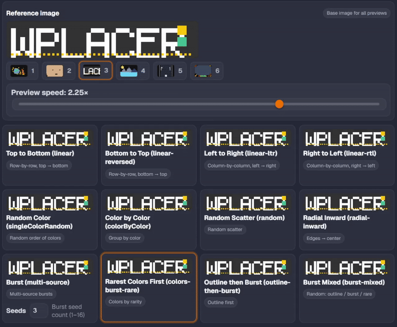
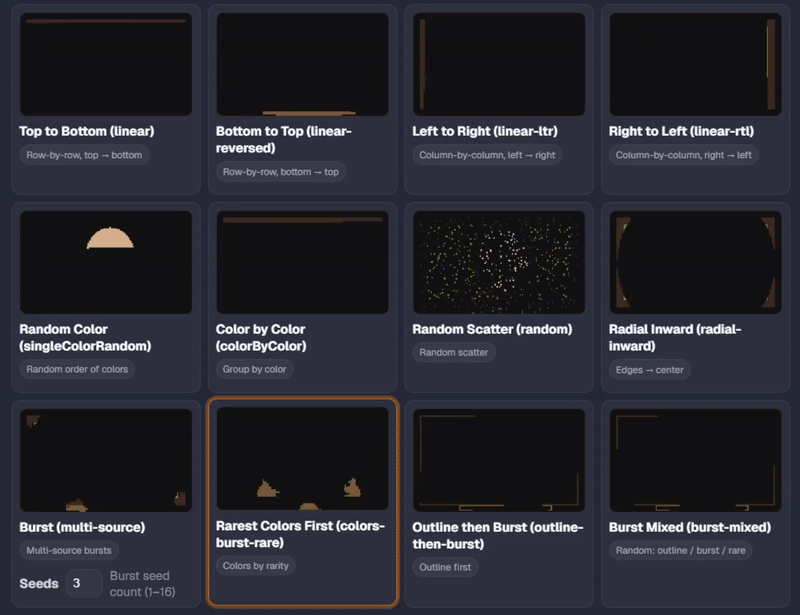

<h1 align="center">
wplacer
</h1>

A massively updated auto-drawing bot for [wplace.live](https://wplace.live/).

## Features ✅

### Web UI (Fully Reworked)

| Core | Highlights |
| --- | --- |
| Navigation | One-click access to Users, Add Template, Manage Templates, Settings |
| User manager | Add via JWT `j` + optional session `s`; status checker (parallel/sequential) for charges / max / level / % / droplets; re-show last stats from local storage; hide sensitive info; quick JSON peek + copy; bulk “Buy Max Upgrades (All)” |
| Add Template | Image→Template converter (palette mapping to wplace IDs); paid colors toggle (exact premium, else nearest basic); coordinates parser from URL; canvas preview overlay with distance and mismatch highlight (respects transparency); per-template toggles: paint transparent, buy charges, buy Max, anti‑grief, auto premium colors; assign users (multi-select / Select All) |
| Manage Templates | Cards with palette type, coords, assigned accounts, progress, pixel counts, enabled options; Start/Stop and Start All/Stop All; Edit/Delete; full-screen preview (zoom/pan, overlay toggle, mismatch highlight, match %) |
| Active Templates bar | Floating mini-preview with quick Stop/Edit actions |
| Settings | Drawing mode gallery with animated previews; reference scenes (Space / Portrait / Typo / Landscape / Dungeon / Emblem); preview speed; Burst seed count; behavior: always draw when ≥1 charge or use charge threshold; Turnstile notifications; timings: account turn/purchase/check cooldowns, anti‑grief standby, droplet reserve |
| Proxy | Enable proxying, rotation mode (sequential/random), log usage, reload `proxies.txt`, show loaded count |

### Painting Engine & Modes

| Core | Highlights |
| --- | --- |
| Palette | Accurate rendering of 63 wplace colors (basic + premium); premium colors are skipped for users who don’t own them |
| Transparency | In templates, `0` = transparent; “Paint transparent pixels” lets you overwrite background |
| Mismatch detection | Loads remote tiles, decodes pixels to palette IDs, compares against template |
| Strategies | Linear: `linear`, `linear-reversed`, `linear-ltr`, `linear-rtl`; Spatial: `radial-inward`, `radial-outward`; Color-centric: `singleColorRandom`, `colorByColor`; Scatter: `random` |
| Burst family | `burst` — multi-seed BFS with dynamic queue speeds and directional dashes; `outline-then-burst` — outlines first, then fill; `colors-burst-rare` — order by color rarity; `burst-mixed` — segmented mix of outline/burst/rare |
| Seeds | Global 1–16; burst seeds persist across turns and reset on image/coordinate changes |

## Previews

### Drawing mods previews:
(1)

(2)

## Installation and Usage 💻

[Video Tutorial](https://www.youtube.com/watch?v=YR978U84LSY)

### Requirements:
- [Node.js and NPM](https://nodejs.org/en/download)
- [Tampermonkey](https://www.tampermonkey.net/)
- [git](https://git-scm.com/downloads) (optional, but recommended)
### Installation:
1. Install the extension on each browser window with an account you want to be used by wplacer and to automatically solve Turnstiles (CAPTCHAs) by going to the extensions page of your browser, turning on developer mode, pressing load unpacked, and then selecting the LOAD_UNPACKED folder included with wplacer.
2. Download the repository using [git](https://git-scm.com/downloads) (`git clone https://github.com/lllexxa/wplacer.git`) or download the ZIP directly from GitHub (not recommended).
3. In the terminal, navigate to the project directory and install the dependencies with `npm i`.
- If you'd like, you can change the host and port of the local server by creating a `.env` file.
### Usage:
1. To start the bot, run `npm start` in the terminal.
2. Open the URL printed in the console (usually `http://127.0.0.1/`) in your browser.
3. In each browser window with the extension installed, log into your account on wplace.live. If your account does not show up in the manager after refreshing it, you can press on the extension to manually send it to wplacer.
4. Go to the "Add Template" page to create your drawing templates.
   - The coordinates (`Tile X/Y`, `Pixel X/Y`) are for the top-left corner of your image. You can find these by clicking a pixel on wplace.live and inspecting the `pixel` request in the Network tab of DevTools. You can also use the [Blue Marble](https://github.com/SwingTheVine/Wplace-BlueMarble) userscript (user TamperMonkey) to see a pixel's coordinates.
   - You can assign multiple users to a single template.
5. Finally, go to "Manage Templates" and click "Start" on any template to begin drawing.
   - The script will occasionally refresh one of the active bot windows on [wplace.live](https://wplace.live/). This is required to refresh the Turnstile token needed for painting.

## Notes 📝

> [!CAUTION]
> This bot is not affiliated with [wplace.live](https://wplace.live/) and its use may be against the site's rules. The developers are not responsible for any punishments against your accounts. Use at your own risk.

### Credits 🙏

-   [luluwaffless](https://github.com/luluwaffless)
-   [Jinx](https://github.com/JinxTheCatto)
-   Fork maintainer: [lllexxa](https://github.com/lllexxa)

### Original wplacer repository

https://github.com/wplacer/wplacer

### License 📜

[GNU AGPL v3](LICENSE)

